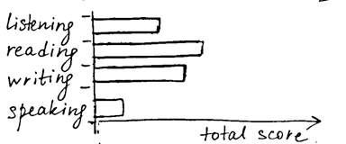

# Academic Performance Dashboard
## Overview
Dashboards often provide at-a-glance views of key performance indicators relevant to a particular objective or business process. This article will show you how AnyChart Charting Solution may help to create an academic performance dashboard. It should be noticed that the dashboard can be extended depending on what users want to see, but here we have a basic sample to understand the concept better.

## Dashboard Concept
Academic Performance Dashboard presents information about students: their targets and achievements, grades and so on. It is very useful for teachers or other people who want to get a quick insight into the progress of each student attending one or another course or progress in general.
This dashboard illustrates English course information and for the sake of convenience it is divided into 4 parts:
1. Table with information about each student separately.
2. Bar chart with total grade assessment.
3. Bar chart with total sections assessment (listening, reading, writing, speaking).
4. Pie chart with percentage of students who chose English as a major subject.

## Visual Presentation
All of the dashboard parts we’ve just mentioned will be on one page, so you don’t need to make extra effort to see the whole picture. All we should do is draw the dashboard on a piece of paper or using some graphics editor in order to choose the best layout. So let’s draw and describe each part.
### Table with all students
This table will provide users with information about each student’s target and final score, achievements in listening, reading, writing and speaking, and show the students for whom English is a major subject. Students will be displayed in descending order of their final scores:

### Total grade assessment
Since we got the information about all the people in class separately, let’s see how many of them got grades A, B, C etc:

### Total sections assessment
Also, we may want to know which section has better results and which one is worth paying attention to:

### Major subject assessment
And the last part of our dashboard is the chart which shows the percentage of students whose major subject is English:

### Final view
So, our Academic Performance Dashboard will look more or less like this:

